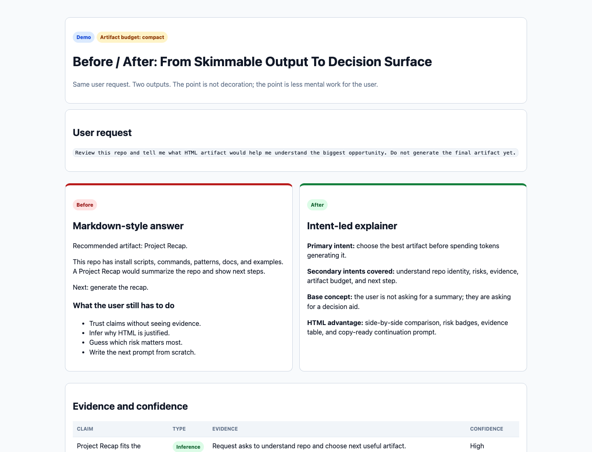

# html-explainer

[](https://github.com/ramsani/html-explainer/actions/workflows/ci.yml)


## Credit First

This project starts from three public contributions that deserve clear credit:

- [`visual-explainer`](https://github.com/nicobailon/visual-explainer) by Nico Bailon, credited as the upstream HTML artifact capability this repo can install and build around.
- ["The unreasonable effectiveness of HTML"](https://thariqs.github.io/html-effectiveness/) by Thariq S. Bate, credited as the conceptual foundation for using HTML when it keeps humans more in the loop than Markdown.
- [`skills`](https://github.com/mattpocock/skills) by Matt Pocock, credited as inspiration for small, composable skill-shaped agent instructions.

`html-explainer` is an independent complementary layer. It does not replace those projects, claim affiliation, or copy their work as product output. It packages an intent-first workflow around them so Claude Code can decide when HTML is worth using, inspect evidence first, and end with a useful next prompt.

See [`CREDITS.md`](CREDITS.md) for the full attribution.

`html-explainer` helps Claude Code create HTML artifacts that people actually read.

It is not "HTML because it looks nice." It is HTML when a browser view helps the user understand, decide, review, compare, tune, or continue work better than Markdown.

Core path:

```text
intent -> evidence -> visual understanding -> decision -> next action -> reusable memory
```

`visual-explainer` gives Claude the HTML artifact capability.

`html-explainer` adds the operating discipline: when to use HTML, what evidence to inspect, how to keep the user in the loop, and how to end with the next useful prompt.

## 60-Second Demo

Open [`examples/before-after-decision.example.html`](examples/before-after-decision.example.html).

It shows the same request two ways:

- a skimmable answer that looks organized but leaves the user to do the hard thinking;
- an intent-led HTML artifact that exposes evidence, risk, recommendation, and a copy-ready next prompt.

The point is simple: HTML is worth the extra tokens only when it removes mental work.

See [`docs/DEMO.md`](docs/DEMO.md) for the demo explanation.

## Visual Preview

This preview shows the core promise: the browser view puts intent, evidence, risk, recommendation, and the next prompt on the same decision surface.



## Install

First run a preview:

```bash
git clone https://github.com/ramsani/html-explainer.git /tmp/html-explainer
cd /tmp/html-explainer
DRY_RUN=1 bash install.sh
```

Then install:

```bash
bash install.sh
```

Restart Claude Code after installation.

The installer adds:

- the `thariq-html-effectiveness` skill;
- intent-first slash commands;
- 7 short core docs, advanced reference docs, patterns, and bundled examples under `~/.claude/html-explainer/`;
- a short managed guide in `~/.claude/CLAUDE.md`;
- backups under `~/.claude/html-explainer/backups/<timestamp>/`.

The `CLAUDE.md` guide is marked with:

```text
<!-- html-explainer:start -->
<!-- html-explainer:end -->
```

Future installs update only that block. Existing `CLAUDE.md` content is not overwritten.

## Update

If you already cloned the repo:

```bash
cd /tmp/html-explainer
git pull origin main
DRY_RUN=1 bash install.sh
bash install.sh
```

If the old clone is gone:

```bash
rm -rf /tmp/html-explainer
git clone https://github.com/ramsani/html-explainer.git /tmp/html-explainer
cd /tmp/html-explainer
DRY_RUN=1 bash install.sh
bash install.sh
```

## Commands

```text
/pick-the-right-html
/make-the-right-html
/check-the-plan
/check-the-diff
/reenter-project
/build-decision-tool
/audit-html
/think-with-me-about
```

| Command | Use it when you want to... |
|---|---|
| `/pick-the-right-html` | Decide whether HTML is worth it and which artifact fits. |
| `/make-the-right-html` | Generate the right verified HTML artifact. |
| `/check-the-plan` | Review a plan before coding. |
| `/check-the-diff` | Review a diff or PR before accepting it. |
| `/reenter-project` | Understand a repo quickly and see the next action. |
| `/build-decision-tool` | Build a temporary editor, triage board, tuner, or config tool. |
| `/audit-html` | Check whether an existing artifact is actually useful. |
| `/think-with-me-about` | Turn a vague topic into a visual thinking surface with evidence, inversion, action, and re-entry. |

## Quick Usage

Start by choosing the right artifact:

```text
/pick-the-right-html revisa esta tarea y dime qué artefacto HTML conviene crear. No generes todavía el HTML.
```

Then generate it:

```text
/make-the-right-html genera el artefacto HTML correcto con evidencia, riesgos, incertidumbre, siguiente acción y prompt listo para copiar.
```

For common repo work:

```text
/reenter-project ayúdame a entender este repo y ver sus áreas de oportunidad usando HTML.
/check-the-plan revisa este plan contra el repo real antes de implementar.
/check-the-diff revisa el diff actual y dime qué aceptar, corregir o revertir.
/build-decision-tool convierte esta decisión en una herramienta HTML editable con exportación.
/think-with-me-about cómo debería decidir si esta idea merece convertirse en producto.
```

Generated artifacts should be saved in a practical local path, opened in the browser when the environment allows it, and returned with a clickable absolute path.

## Local Artifact Memory

`html-explainer` can generate artifacts that remain useful after the current chat. The repo now defines a local-first artifact memory model for saving generated HTML outputs outside the repository.

The core boundary is:

```text
The repo is the system.
The local output folder is the user's artifact memory.
```

Recommended local output root:

```text
~/.claude/html-explainer/outputs/
```

The artifact memory system defines:

- lifespan classes: `temporal`, `replaceable`, `evergreen`, `superseded`, `private`, and `do-not-reuse`;
- metadata and index schemas;
- freshness, privacy, re-entry, and supersession rules;
- an actionable knowledge base model for search, relations, quick-reference cards, and next actions;
- a static explorer template that follows the same decision-ready HTML principles as the rest of the project.

Start here:

- [`docs/ARTIFACT_MEMORY.md`](docs/ARTIFACT_MEMORY.md)
- [`docs/ARTIFACT_METADATA_SCHEMA.md`](docs/ARTIFACT_METADATA_SCHEMA.md)
- [`docs/ACTIONABLE_KNOWLEDGE_BASE.md`](docs/ACTIONABLE_KNOWLEDGE_BASE.md)
- [`templates/artifact-explorer.html`](templates/artifact-explorer.html)
- [`examples/artifact-index.example.json`](examples/artifact-index.example.json)
- [`examples/artifact-metadata.example.json`](examples/artifact-metadata.example.json)

## Artifact Direction System

The repo now treats recurring artifact work as small packages instead of one-off prompts.

Start here:

- [`docs/ARTIFACT_DIRECTIONS.md`](docs/ARTIFACT_DIRECTIONS.md)
- [`docs/ARTIFACT_MODES.md`](docs/ARTIFACT_MODES.md)
- [`docs/ARTIFACT_CHECKLISTS.md`](docs/ARTIFACT_CHECKLISTS.md)
- [`docs/ANTI_SLOP.md`](docs/ANTI_SLOP.md)
- [`docs/PATTERN_PACKAGE_PROTOCOL.md`](docs/PATTERN_PACKAGE_PROTOCOL.md)
- [`docs/OPEN_DESIGN_LEARNINGS.md`](docs/OPEN_DESIGN_LEARNINGS.md)

## When HTML Is Worth It

Use HTML when the output replaces something people would skim or misunderstand:

| Work type | HTML should add |
|---|---|
| Exploration & Planning | Side-by-side options, trade-offs, dependencies, recommendation. |
| Code Review | Annotated diff, risk map, findings by severity, next action. |
| Design | Visual directions, component states, tokens, responsive states. |
| Prototyping | Clickable flows, sliders, knobs, live preview, export. |
| Diagrams | Architecture, workflows, failure paths, boundaries. |
| Decks | Shareable decision or progress story. |
| Research | Criteria, evidence quality, recommendation by use case. |
| Reports | Timeline, scorecard, risks, reentry checklist. |
| Custom Editors | Drag, sort, tune, validate, then copy the result out. |

Do not use HTML for short answers, single commands, tiny facts, or low-consequence notes.

## What Good Output Must Do

Every artifact should:

- answer the user's main intent directly;
- cover obvious secondary needs when they affect the decision;
- show the evidence inspected;
- separate facts, inferences, assumptions, and unknowns;
- use the smallest useful artifact size;
- explain why HTML beats Markdown for this case;
- respect system light/dark mode;
- keep visual design minimal, flat, readable, and professional;
- end with a clear next action, an editable next prompt, and an archive recommendation when the result may be useful later.

If interaction is included, it must change something meaningful and export usable output: Markdown, JSON, config, issue body, checklist, or prompt.

## Internal Shape

The default agent path is intentionally small:

```text
DECISION_GATE -> PATTERN_GUIDE -> pattern file -> FACT_SHEET -> STYLE -> QUALITY_BAR -> CHAIN -> DELIVERY -> ARTIFACT_MEMORY
```

Detailed older docs live in `docs/reference/`. They are available when needed, but they are not the default path.

## What It Adds Over visual-explainer

`visual-explainer` is excellent at generating rich HTML artifacts.

`html-explainer` is for users who want more control over the reasoning before and after the artifact:

- intent selection before generation;
- evidence-first workflow;
- pattern routing;
- quality bar;
- lean artifact budget;
- next-step prompts that preserve context;
- safe installer and uninstaller;
- brief `CLAUDE.md` guide so the agent remembers how to use the system.

Use `visual-explainer` when you mainly want quick HTML output.

Use `html-explainer` when the HTML should help make or review a real decision.

## What This Is Not

- Not a standalone web app.
- Not an official Anthropic or Claude Code project.
- Not a replacement for `visual-explainer`.
- Not a general visual design tool.
- Not HTML for every answer.

Use it when HTML helps the user make or review a real decision.

## Contributing

Contributions are welcome when they strengthen the core path:

```text
intent -> evidence -> visual understanding -> decision -> next action -> reusable memory
```

See [`CONTRIBUTING.md`](CONTRIBUTING.md) before opening a PR.

## Safe Uninstall

Preview:

```bash
DRY_RUN=1 bash uninstall.sh
```

Restore latest backup, or remove managed files if no backup exists:

```bash
bash uninstall.sh
```

Remove without restoring backup:

```bash
RESTORE_BACKUP=0 bash uninstall.sh
```

Remove and delete backups:

```bash
KEEP_BACKUPS=0 bash uninstall.sh
```

The uninstaller removes only the managed `CLAUDE.md` block. It does not rewrite the rest of your memory file.

## Installer Flags

```bash
# Skip upstream visual-explainer
INSTALL_UPSTREAM=0 bash install.sh

# Optionally download external Thariq reference pages
FETCH_EXAMPLES=1 bash install.sh

# Install into another Claude home
CLAUDE_HOME="$HOME/.claude" bash install.sh
```

## Verify Locally

```bash
bash -n install.sh uninstall.sh scripts/*.sh
scripts/validate-patterns.sh
scripts/validate-commands.sh
scripts/validate-examples.sh
scripts/validate-scenarios.sh
DRY_RUN=1 INSTALL_UPSTREAM=0 FETCH_EXAMPLES=0 bash install.sh
scripts/smoke-install.sh
scripts/smoke-uninstall.sh
```

## Credits

This project is an independent integration layer inspired by and built around:

- [visual-explainer](https://github.com/nicobailon/visual-explainer) by Nico Bailon;
- Thariq S. Bate's HTML effectiveness approach;
- Matt Pocock's skill and workflow style for practical engineering prompts.

It is not an official project of Nico Bailon, Thariq S. Bate, Matt Pocock, Anthropic, or Claude Code.

See [`CREDITS.md`](CREDITS.md) and [`CHANGELOG.md`](CHANGELOG.md).
